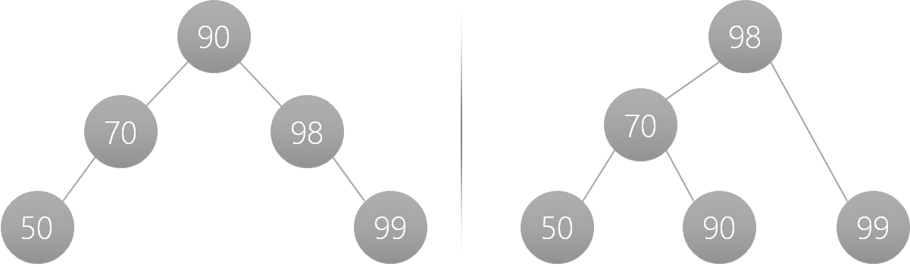

# Binary Search Tree (BST)
<ul>
    <li>Needs a key.</li>
    <li>Compare those keys.</li>
    <li>The left node's key will always be smaller than the parent nodes key.</li>
    <li>the right node's key will be larger than the parent node.</li>
</ul>

<image src="./images/bst.png" />

## Why?
So, why should we care about a BST? We should care because searching is really performant in it as each time you move a depth down, you eliminate approximately 50% of the potential nodes.

So, for example, if we wanted to find the item in our example with the key 66, we could start at the root (50) and move right. At that point, we have eliminated 8 possible nodes immediately. The next is to the left from the node with the 70 (total possible nodes removed 12). Next is to the right of the node with the value of 65, and then to 66 to the left of 67. So we found the node with 5 steps.

## Balanced Vs. Unbalanced
In the above example we have a binary search tree which is Optimal, i.e. it has the lowest depth needed. Below we can see a totally valid BST; each child node is to the right of the parent because it is bigger than the parent.

<image src="./images/unbalanced.png" />

This, however, will result in an O(n) search performance which is not ideal. The solution is to rebalance the BST and for our example above we can end up with multiple end states (I'll show two below). The key takeaway is that we go from a depth of 5 to a depth of 3.

